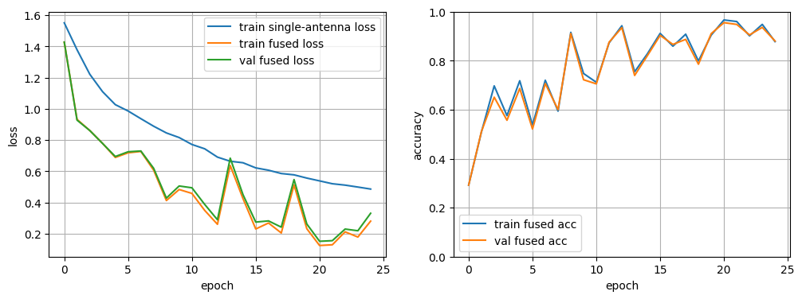

# Wi-Fi Doppler HAR

## SHARP Reproduction

We reproduced the SHARP paper training setup with a shared single-antenna
classifier and decision fusion across four antenna streams. The reproduction
notebook is `notebooks/sharp_reproduction.ipynb`.

At epoch 25, the run reached:

```text
train_loss      : 0.4856
train_sum_acc   : 0.8698
train_sharp_acc : 0.8779
val_sum_acc     : 0.8810
val_sharp_acc   : 0.8804
best_val_acc    : 0.9553 @ epoch 21
```



## Environment Setup

This project keeps the shared Python dependencies separate from the PyTorch
installation. PyTorch depends on the available hardware, so each contributor
should install the build that matches their machine.

First, create and activate a Python 3.11 environment, then install the common
dependencies:

```powershell
pip install -r requirements.txt
```

Then install PyTorch using one of the options below.

For CPU-only machines:

```powershell
pip install torch torchvision --index-url https://download.pytorch.org/whl/cpu
```

For NVIDIA CUDA machines, install the CUDA build that matches your driver. For
example, for CUDA 12.1:

```powershell
pip install torch torchvision --index-url https://download.pytorch.org/whl/cu121
```

On Google Colab, PyTorch is usually already installed. In a notebook, run:

```python
import torch

print(torch.__version__)
print(torch.cuda.is_available())
```

If Colab is missing any project dependency, install only the shared
requirements:

```python
!pip install -r requirements.txt
```

Training code should use automatic device selection by default:

```python
device = "cuda" if torch.cuda.is_available() else "cpu"
```
