# PI Experiment Log

This file records person-identification experiments on SHARP Doppler traces. Entries are intentionally factual and may include preliminary results; final report text should be written later from the cleaned-up subset of these runs.

## Current Modeling Choice

We are using the SHARP-style CNN as a baseline encoder/classifier for person identification. The input is the four-antenna Doppler window from `data/doppler_traces_pi`.

For PI, the training objective should match the test-time decision surface: the model predicts identity from the fused four-antenna output. Earlier SHARP activity-recognition reproduction trained the shared single-antenna CNN by applying cross-entropy to each antenna independently, then fused antenna decisions. For PI we changed the objective to compute cross-entropy on the fused model output instead.

Current baseline:

- Backbone: SHARP `SingleAntennaModel`
- Multi-antenna wrapper: shared backbone over four antenna streams
- Fusion: mean of antenna logits
- Loss: cross-entropy on fused logits
- Task label: person identity token parsed from filename, e.g. `p03`

Rationale: the model is evaluated using all four antennas, so optimizing the fused output is more consistent than optimizing each antenna as a standalone classifier.

## Protocol Definitions

The word "domain" can refer to two different things in these experiments, so we define the evaluation protocols explicitly.

### Zero-Shot Cross-Domain Classification

Train a classifier on source domains and directly classify windows from a held-out target domain:

```text
train: PI-1a, PI-2a, PI-3a
test:  PI-4a
```

No target-domain enrollment examples are used. This is the strictest domain-transfer setting for the softmax classifier.

### Same-Domain K-Shot Enrollment

Build prototypes and query examples from the same PI domain:

```text
enrollment: PI-4a split 0.0-0.6
query:      PI-4a split 0.6-0.8
```

This is not zero-shot domain generalization. It is a few-shot enrollment protocol: the model is allowed to see `K` examples per person from the target domain before classifying target-domain query windows. This is still a valid person-identification setting because enrollment is realistic in PI.

### Mixed-Source K-Shot Enrollment

Build each person prototype from a pooled source-domain enrollment set and evaluate on a pooled source-domain query set:

```text
enrollment: PI-1a, PI-2a, PI-3a split 0.0-0.6
query:      PI-1a, PI-2a, PI-3a split 0.6-0.8
```

This tests whether one prototype per identity remains stable across multiple source Wi-Fi configurations. It is harder than same-domain K-shot because a single prototype may average together domain-specific embedding clusters.

### Cross-Domain K-Shot Without Target Enrollment

Build prototypes from source-domain enrollment samples and classify query samples from a different target domain:

```text
enrollment: PI-1a, PI-2a, PI-3a
query:      PI-4a
```

This is the hardest metric-learning protocol. It tests whether identity embeddings are domain-invariant without target-domain enrollment. We have not yet used this as the main metric.

### Current Interpretation

The previous strong `PI-4a` K-shot result should be described as:

```text
few-shot enrollment in an unseen target domain
```

It should not be described as:

```text
zero-shot cross-domain generalization
```

The distinction matters because the `PI-4a` prototypes are also built from `PI-4a` samples, so the prototype step adapts to the held-out domain.

## 2026-05-25 - 5-Person Same-Domain Sharp Model Mean Fusion

### Question

Can SHARP Doppler traces support basic person identification in a same-domain PI setting?

### Setup

- Data: `data/doppler_traces_pi`
- Train domain: `PI-1a`
- Validation domain: `PI-1a`
- Split: temporal split inside each trace
  - train: `split=(0, 0.6)`
  - validation: `split=(0.6, 0.8)`
- Persons: `p03`, `p05`, `p06`, `p07`, `p08`
- Chance accuracy: 20%
- Model: SHARP CNN backbone with four-antenna wrapper
- Fusion: `mean`
- Objective: cross-entropy on fused four-antenna logits
- Epochs: 25
- Window size: 340
- Window stride: 30

### Result

- Best validation accuracy: `0.8464`
- Restored validation accuracy: `0.8464`
- Best epoch: 20

### Artifacts

- Run directory: [experiments/pi_classification/pi_5persons_same_domain_sharp_model_20260525_152103](../experiments/pi_classification/pi_5persons_same_domain_sharp_model_20260525_152103)

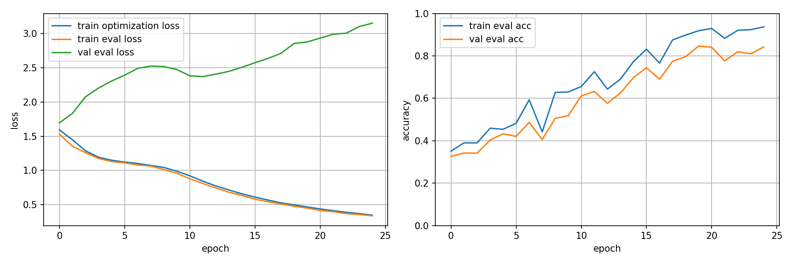

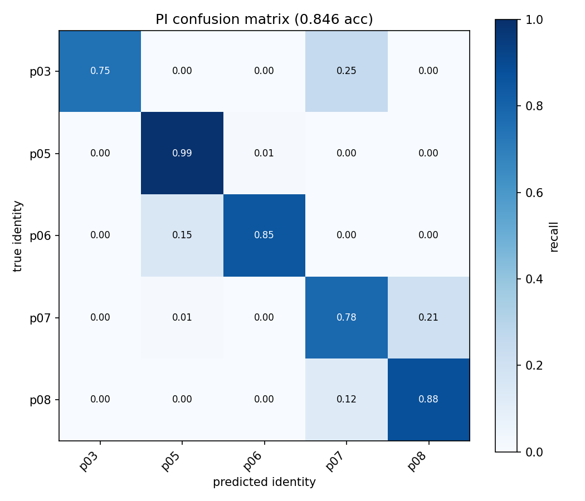

### Interpretation

This is a sanity-check result, not the final contribution. Accuracy is clearly above chance, which suggests SHARP Doppler contains person-specific information for these five identities in the same PI domain.

The result does not yet establish domain robustness because training and validation are both from `PI-1a`. The temporal split may also contain correlated neighboring windows, so this should be treated as an optimistic baseline.

## 2026-05-25 - 10-Person Cross-Domain Sharp Model Mean Fusion

This rerun logs both source-domain validation and target-domain validation, so we can separate ordinary train/validation learning from held-out-domain generalization.

### Question

Does the SHARP Doppler classifier generalize across PI domain shifts when trained on three PI domains and tested on a fourth?

### Setup

- Data: `data/doppler_traces_pi`
- Persons: all available PI identities `p03`, `p05`-`p13`
- Model: SHARP CNN backbone with four-antenna wrapper
- Fusion: `mean`
- Objective: cross-entropy on fused four-antenna logits
- Protocol: train on three PI domains, validate on both source domains and a held-out fourth domain
- Train domains: `PI-1a`, `PI-2a`, `PI-3a`
- Source validation domains: `PI-1a`, `PI-2a`, `PI-3a`
- Target validation domain: `PI-4a`
- Split: temporal split inside each trace
  - train: `split=(0, 0.6)`
  - validation: `split=(0.6, 0.8)`
- Epochs: 25
- Window size: 340
- Window stride: 30

### Result

- Best target validation accuracy: `0.3159`
- Restored target validation accuracy: `0.3159`
- Best target epoch: 14
- Final train eval accuracy: `0.7643`
- Final source-domain validation accuracy: `0.7032`
- Final target-domain validation accuracy: `0.2986`
- Final train eval loss: `0.7294`
- Final source-domain validation loss: `1.4194`
- Final target-domain validation loss: `2.2990`

### Artifacts

- Run directory: [outputs/pi_classification/pi_all_persons_123_train_4_test_sharp_model_20260525_165437](../experiments/pi_classification/pi_all_persons_123_train_4_test_sharp_model_20260525_165437)

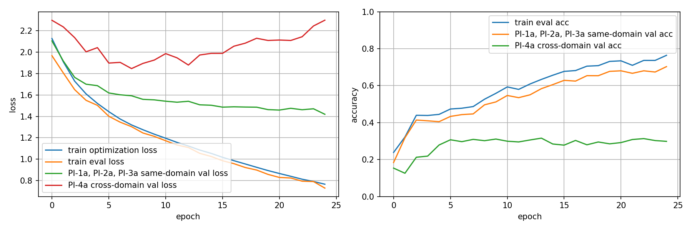

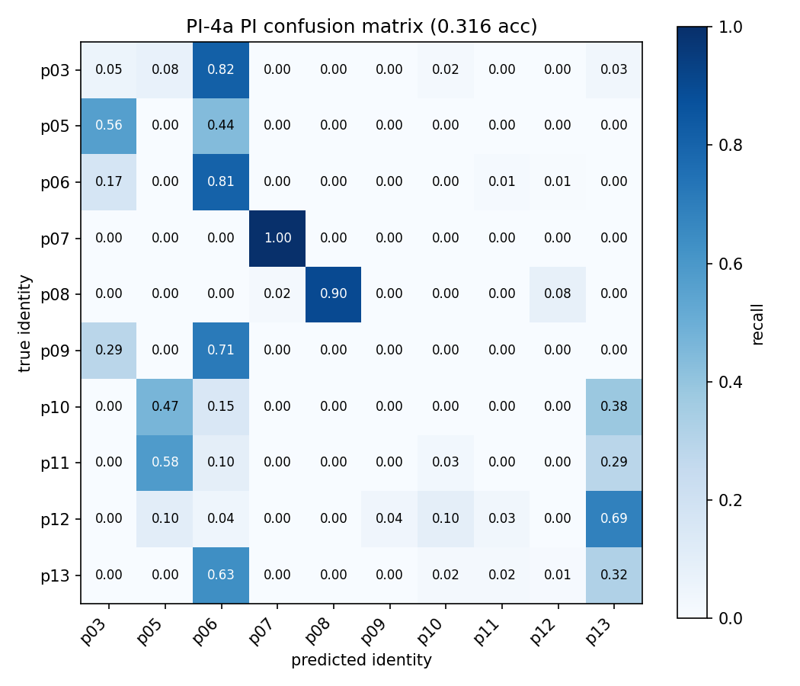

### Interpretation

This result makes the domain gap clearer than the previous run. The model learns the source domains: final train accuracy is about `76%`, and source-domain validation reaches about `70%` using a held-out temporal split from the same PI domains. However, performance on the unseen `PI-4a` domain peaks at only about `32%` and finishes around `30%`.

This suggests the SHARP Doppler representation contains person-identification signal, but a standard fused softmax classifier does not learn identity features that transfer cleanly across the PI domain shift. The gap is large despite the meeting-room label being the same, because `PI-4a` differs in monitor position, Tx/Rx link, NLOS obstruction, and TP-Link receiver configuration.

For the project direction, this is a useful baseline rather than a blocker. It motivates few-shot target-domain enrollment: instead of expecting zero-shot transfer to `PI-4a`, the next question is whether a small number of target-domain examples per identity can adapt the embedding through prototype inference.

## Planned - Few-Shot Target-Domain Enrollment

### Question

Can a small number of target-domain enrollment examples improve person identification under PI domain shift?

### Important Distinction

This experiment is not true unseen-person few-shot identification. The dataset only has 10 PI identities, so holding out people would leave too few identities for a strong training/evaluation protocol.

The intended first few-shot setting is known-identity target-domain adaptation:

- Train identities: all 10 PI people
- Train domains: source PI domains, e.g. `PI-1a`, `PI-2a`, `PI-3a`
- Target domain: held-out PI domain, e.g. `PI-4a`
- Target enrollment: sample `K` windows per person from the target domain
- Target query: classify the remaining target-domain windows

This evaluates whether a few target-domain examples can compensate for the domain shift observed in the zero-shot softmax baseline.

### Protocol

1. Train an encoder on source domains.
2. Remove or ignore the final softmax classifier.
3. Extract embeddings from target-domain windows.
4. For each person, sample `K` target-domain enrollment windows.
5. Average their embeddings to form one prototype per person.
6. Classify target-domain query windows by nearest prototype.

Candidate values:

- `K = 1, 3, 5, 10`
- Distance: cosine similarity or Euclidean distance after embedding normalization
- Repeat random enrollment sampling several times and report mean/std accuracy

### Baselines

Softmax-trained encoder:

- Use the current fused softmax classifier as a cheap embedding baseline.
- This does not optimize a few-shot objective.
- It only tests whether ordinary cross-entropy training accidentally learns an embedding useful for prototype inference.

Supervised contrastive encoder:

- Train with same-person positives and different-person negatives.
- Evaluate with the same K-shot prototype protocol.
- This better matches the few-shot objective because the training loss directly shapes embedding distances.

### Expected Comparison

Report at least:

- Zero-shot softmax prediction on held-out target domain
- Softmax-trained embedding + K-shot prototype inference
- Supervised contrastive embedding + K-shot prototype inference

The key result is whether target-domain enrollment closes part of the gap between source-domain validation accuracy and held-out-domain zero-shot accuracy.

## 2026-05-26 - Few-Shot Softmax Embedding Evaluation

### Question

Can target-domain K-shot prototype inference improve over zero-shot softmax prediction when using the already-trained softmax SHARP model as an embedding extractor?

### Setup

- Encoder checkpoint: softmax SHARP model trained on `PI-1a`, `PI-2a`, `PI-3a`
- Target domain: `PI-4a`
- Persons: all 10 PI identities, `p03`, `p05`-`p13`
- Enrollment source: target-domain windows
- Query source: held-out target-domain windows
- Embedding source: pre-classifier SHARP CNN features from the softmax-trained model
- Prototype method: sample `K` enrollment windows per person, average embeddings into one prototype per person, classify query embeddings by nearest prototype
- Trials per K: 20

### Result

| K enrollment windows/person | Mean query accuracy | Std |
| ---: | ---: | ---: |
| 1 | `0.2046` | `0.0328` |
| 3 | `0.2517` | `0.0210` |
| 5 | `0.2765` | `0.0228` |
| 10 | `0.3044` | `0.0144` |
| 25 | `0.3248` | `0.0184` |
| 50 | `0.3269` | `0.0125` |
| 100 | `0.3416` | `0.0091` |

### Artifacts

- Run directory: [experiments/few_shot_softmax_evaluation/few_shot_softmax_evaluation_20260526_171738](../experiments/few_shot_softmax_evaluation/few_shot_softmax_evaluation_20260526_171738)
- Results JSON: [pi_few_shot_softmax_results.json](../experiments/few_shot_softmax_evaluation/few_shot_softmax_evaluation_20260526_171738/pi_few_shot_softmax_results.json)

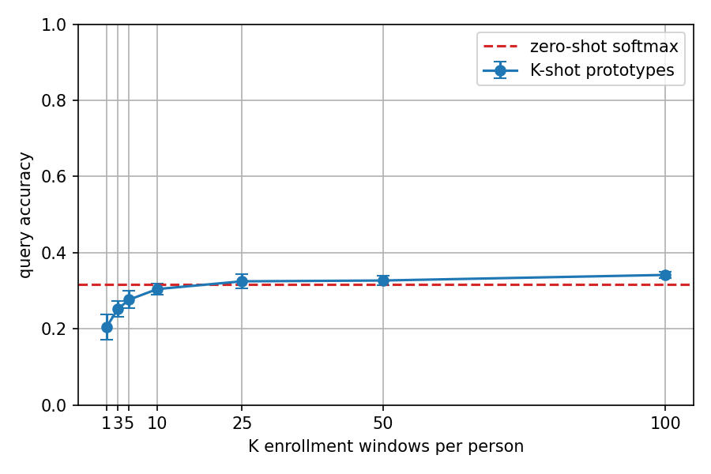

### Interpretation

Accuracy increases with K, which suggests the prototype evaluation is behaving sensibly: more enrollment windows produce more stable person prototypes. However, the improvement is modest. Small-K settings are weak, and even `K=100` reaches only about `34%` query accuracy.

This indicates that the softmax-trained SHARP encoder is not a strong metric embedding model for few-shot prototype inference. The classifier was trained to separate known identities through a learned linear head, not to make same-person windows cluster tightly under cosine or Euclidean distance. This result strengthens the motivation for supervised contrastive training, where the objective directly optimizes embedding geometry for prototype-style inference.

## 2026-05-27 - Prototypical Training With Raw SHARP Feature Maps

### Question

Does episodic prototypical training improve the SHARP representation when the embedding is the flattened SHARP feature map?

### Setup

- Data: `data/doppler_traces_pi`
- Persons: all 10 PI identities, `p03`, `p05`-`p13`
- Train domains: `PI-1a`, `PI-2a`, `PI-3a`
- Source validation domains: `PI-1a`, `PI-2a`, `PI-3a`
- Target validation domain: `PI-4a`
- Target validation protocol: target-domain enrollment support windows from `PI-4a`, target-domain query windows from held-out `PI-4a`
- Model: SHARP multi-antenna model
- Embedding: flattened pre-classifier SHARP convolutional feature maps
- Objective: 10-way prototypical loss with cosine prototype logits
- Episode shape: `K=5` support windows/person, `Q=10` query windows/person
- Training length: about 4500 sampled prototypical steps

### Result

- Training loss decreased from about `2.30` to roughly `2.15`-`2.20`.
- Training episodic accuracy improved above chance but remained noisy, mostly around `25%`-`35%`.
- Source-domain episodic validation accuracy plateaued around `25%`-`30%`.
- Target-domain episodic validation briefly reached about `50%`, then fell back and stabilized around `30%`.
- Final K-shot comparison against the softmax embedding baseline was not completed for this diagnostic run.

### Artifacts

- Run directory: [experiments/few_shot_proto_evaluation/proto_multi_antenna_vs_softmax_baseline_20260527_164722](../experiments/few_shot_proto_evaluation/proto_multi_antenna_vs_softmax_baseline_20260527_164722)

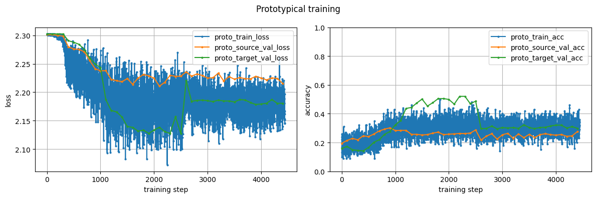

### Interpretation

This run showed that episodic training was not completely random: both loss and accuracy moved away from the 10-way chance baseline. However, the improvement was weak and unstable. The raw flattened SHARP feature map is likely a poor metric-learning space because it is high-dimensional and was originally designed for activity-classification logits, not for compact identity clustering.

The target-domain validation curve should not be interpreted as zero-shot generalization, because target prototypes are built from `PI-4a` enrollment windows. The temporary target-domain spike suggests that some identity structure exists in the Doppler features, but the representation did not settle into a robust prototype space. This motivated adding an explicit projection head.

## 2026-05-28 - Prototypical Training With 128-D Embedding Head

### Question

Does adding a trainable 128-D projection head after the SHARP backbone produce a better prototypical identity embedding?

### Setup

- Data: `data/doppler_traces_pi`
- Persons: all 10 PI identities, `p03`, `p05`-`p13`
- Train domains: `PI-1a`, `PI-2a`, `PI-3a`
- Source validation domains: `PI-1a`, `PI-2a`, `PI-3a`
- Target validation domain: `PI-4a`
- Model: SHARP backbone with multi-antenna encoder
- Embedding head: `Flatten -> LazyLinear(256) -> ReLU -> Dropout -> Linear(128)`
- Embedding normalization: enabled
- Fusion: mean of antenna embeddings
- Objective: 10-way prototypical loss with cosine prototype logits
- Episode shape: `K=5` support windows/person, `Q=16` query windows/person
- Training length: 3000 sampled prototypical steps

### Result

- Training loss decreased more clearly than in the raw-feature run, reaching roughly `2.0` by the end.
- Source-domain validation loss also decreased, reaching roughly `2.05`-`2.10`.
- Target-domain validation loss decreased but remained noisy.
- Episodic train/source/target accuracies stayed low, mostly around `20%`-`30%`.
- The final K-shot comparison against the softmax embedding baseline crashed due to memory pressure, so this run is not a complete method comparison.

### Artifacts

- Run directory: [experiments/few_shot_proto_evaluation/proto_multi_antenna_vs_softmax_baseline_20260527_164722](../experiments/few_shot_proto_evaluation/proto_multi_antenna_vs_softmax_baseline_20260527_164722)

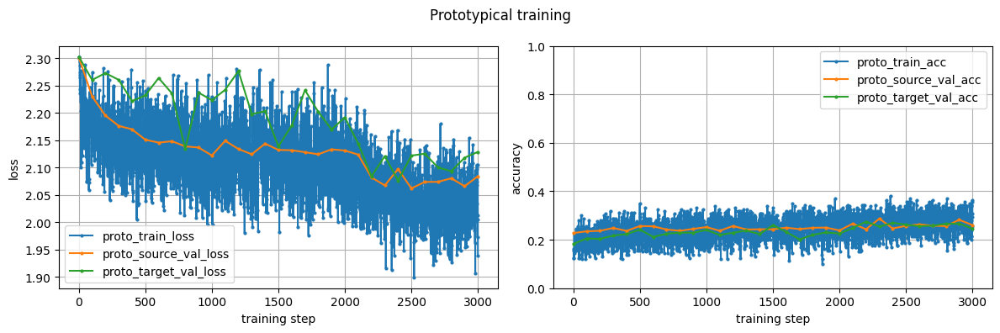

### Interpretation

The projection head improved the loss behavior, which suggests the model was learning a more suitable embedding space than the raw feature-map baseline. However, the accuracy curves did not improve enough to make this a strong result by themselves. The gap between decreasing loss and weak accuracy may come from compressed cosine logits: cosine similarities are bounded in `[-1, 1]`, so cross-entropy may receive a weak class-separation signal unless logits are temperature-scaled.

This run suggests that architecture alone is not sufficient. The next prototypical run should save the trained model before K-shot evaluation, reduce memory pressure during evaluation, and test temperature-scaled prototype logits such as `temperature=0.1`.

## 2026-05-28 - Prototypical Training With 128-D Head, Temperature Scaling, Early Stopping

### Question

Does temperature scaling and best-checkpoint selection make the 128-D prototypical encoder competitive with the softmax feature-map embedding baseline?

### Setup

- Data: `data/doppler_traces_pi`
- Persons: all 10 PI identities, `p03`, `p05`-`p13`
- Train domains: `PI-1a`, `PI-2a`, `PI-3a`
- Source validation domains: `PI-1a`, `PI-2a`, `PI-3a`
- Target validation domain: `PI-4a`
- Model: SHARP backbone with multi-antenna encoder
- Embedding head: `Flatten -> LazyLinear(256) -> ReLU -> Dropout -> Linear(128)`
- Embedding normalization: enabled
- Fusion: mean of antenna embeddings
- Objective: 10-way prototypical loss with cosine prototype logits
- Temperature: `0.1`
- Episode shape: `K=5` support windows/person, `Q=16` query windows/person
- Maximum training length: 3000 sampled prototypical steps
- Early stopping metric: `proto_source_val_acc`
- Best checkpoint: step `1900`

### Result

Training did improve compared with random guessing, but the final embedding was weak.

- Best source validation episodic accuracy: `0.3059` at step `1900`
- Final target validation episodic accuracy: about `0.2925`
- Train episodic accuracy remained noisy and mostly below `40%`
- The model stopped early after the source validation metric stopped improving

Target-domain same-domain K-shot evaluation on `PI-4a`:

| K enrollment windows/person | Softmax feature-map mean acc | Proto 128-D mean acc |
| ---: | ---: | ---: |
| 1 | `0.2046` | `0.2735` |
| 3 | `0.2517` | `0.2753` |
| 5 | `0.2765` | `0.2621` |
| 10 | `0.3044` | `0.2685` |
| 25 | `0.3248` | `0.2684` |
| 50 | `0.3269` | `0.2601` |
| 100 | `0.3416` | `0.2626` |

### Artifacts

- Run directory: [experiments/few_shot_proto_evaluation/proto_multi_antenna_vs_softmax_baseline_20260528_184419](../experiments/few_shot_proto_evaluation/proto_multi_antenna_vs_softmax_baseline_20260528_184419)

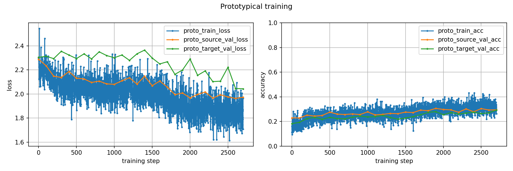

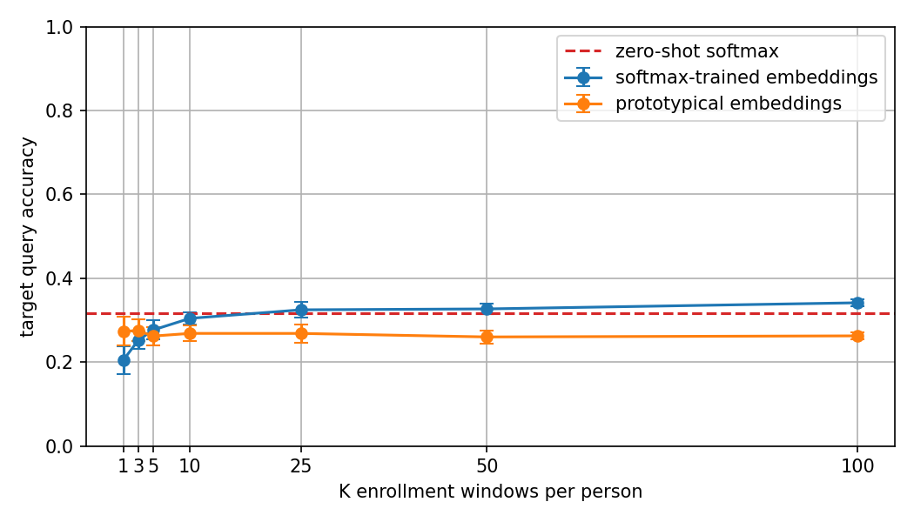

### Interpretation

This run is worse than expected. Temperature scaling helped the loss become more usable, but it did not produce a strong identity embedding. The 128-D prototypical model only beats the softmax feature-map baseline for `K=1` and `K=3`; after that, increasing enrollment size does not improve the prototype, and the curve stays around `26%`-`28%`.

This suggests that the learned 128-D space is not centered around person identity. More enrollment samples do not produce a cleaner prototype, which is a key failure signal for prototype inference.

A likely architectural issue is that the projection head is much larger than intended. The flattened SHARP feature map has dimension `25500`, so the projection head has about `6.56M` parameters:

```text
Flatten(25500) -> Linear(256) -> Linear(128)
```

By comparison, the previous softmax classifier head only maps `25500 -> 10`, around `255k` parameters. The new projection head may be over-parameterized and may compress away the useful high-dimensional feature-map geometry.

## 2026-05-28 - Source-Domain K-Shot Diagnostic

### Question

Do the prototype embeddings fail even before the held-out `PI-4a` domain shift, or is the failure mainly caused by target-domain transfer?

### Setup

- Data: `data/doppler_traces_pi`
- Persons: all 10 PI identities, `p03`, `p05`-`p13`
- Evaluation protocol: mixed-source K-shot enrollment
- Enrollment domains: `PI-1a`, `PI-2a`, `PI-3a`
- Query domains: `PI-1a`, `PI-2a`, `PI-3a`
- Enrollment split: `0.0`-`0.6`
- Query split: `0.6`-`0.8`
- Compared embeddings:
  - softmax-trained SHARP feature maps
  - old prototypical model using raw SHARP feature maps
  - new prototypical model using the 128-D projection head

### Result

| K enrollment windows/person | Softmax feature maps | Old proto feature maps | New proto 128-D encoder |
| ---: | ---: | ---: | ---: |
| 1 | `0.1727` | `0.2361` | `0.2181` |
| 3 | `0.2346` | `0.2547` | `0.2691` |
| 5 | `0.2390` | `0.2715` | `0.2712` |
| 10 | `0.2499` | `0.2702` | `0.2889` |
| 25 | `0.2800` | `0.2672` | `0.2905` |
| 50 | `0.2988` | `0.2684` | `0.2980` |
| 100 | `0.2949` | `0.2629` | `0.3014` |

### Artifacts

- Run directory: [experiments/few_shot_source_domain_evaluation/source_domain_featuremap_vs_projection_20260528_200640](../experiments/few_shot_source_domain_evaluation/source_domain_featuremap_vs_projection_20260528_200640)
- Notebook: [notebooks/PI_few_shot_source_domain_check.ipynb](../notebooks/PI_few_shot_source_domain_check.ipynb)

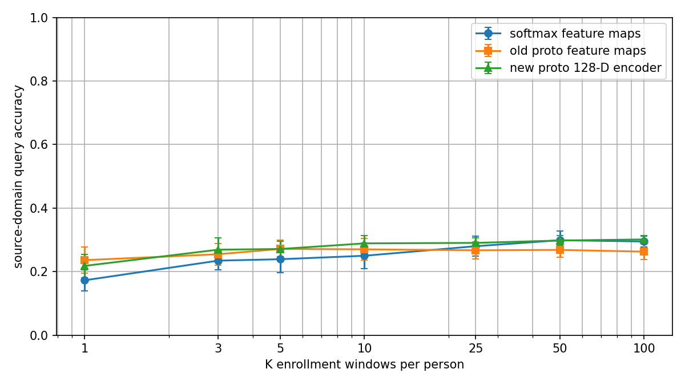

### Interpretation

All three curves are close together and remain low. This initially looked inconsistent with the previous old-proto `PI-4a` K-shot result, where the old raw-feature prototypical model reached about `63%` at `K=100`.

The difference is the evaluation protocol.

The previous strong result used same-domain target enrollment:

```text
enrollment: PI-4a split 0.0-0.6
query:      PI-4a split 0.6-0.8
```

This lets the prototype adapt to the target domain. The new source-domain diagnostic pools several source domains into one enrollment/query pool:

```text
enrollment: PI-1a, PI-2a, PI-3a split 0.0-0.6
query:      PI-1a, PI-2a, PI-3a split 0.6-0.8
```

Therefore each identity prototype may average embeddings from multiple Wi-Fi configurations. If the representation is domain-fragmented, one person may form separate clusters in `PI-1a`, `PI-2a`, and `PI-3a`. Averaging those clusters into one prototype can hurt accuracy.

This means the `PI-4a` result is not wrong, but it answers a different and easier question:

```text
Given K enrollment samples from a new target Wi-Fi setup, can we classify later samples from that same setup?
```

The mixed-source diagnostic asks:

```text
Can one prototype per person survive multiple source Wi-Fi configurations at once?
```

The answer so far appears to be mostly no. This is useful for the report because it suggests the embeddings contain identity information, but identity is entangled with domain/setup effects.

### Next Diagnostic

Run per-domain same-domain K-shot evaluation:

```text
PI-1a enrollment -> PI-1a query
PI-2a enrollment -> PI-2a query
PI-3a enrollment -> PI-3a query
PI-4a enrollment -> PI-4a query
```

If per-domain results are high but mixed-domain results are low, the main issue is domain-fragmented identity clusters. If per-domain results are also low, the metric embedding itself is weak.

## 2026-05-28 - Per-Domain Same-Domain K-Shot Diagnostic

### Question

Are the low mixed-source K-shot results caused by weak identity embeddings in every domain, or by averaging domain-specific clusters into one pooled prototype?

### Setup

- Data: `data/doppler_traces_pi`
- Persons: all 10 PI identities, `p03`, `p05`-`p13`
- Evaluation protocol: same-domain K-shot enrollment, evaluated separately per PI domain
- Domains tested: `PI-1a`, `PI-2a`, `PI-3a`, `PI-4a`
- Enrollment split: `0.0`-`0.6`
- Query split: `0.6`-`0.8`
- Compared embeddings:
  - softmax-trained SHARP feature maps
  - old prototypical model using raw SHARP feature maps
  - new prototypical model using the 128-D projection head

### Result

Best `K=100` same-domain query accuracies:

| Domain | Softmax feature maps | Old proto feature maps | New proto 128-D encoder |
| --- | ---: | ---: | ---: |
| `PI-1a` | `0.4298` | `0.8670` | `0.3356` |
| `PI-2a` | `0.4028` | `0.7746` | `0.3463` |
| `PI-3a` | `0.3505` | `0.6294` | `0.4652` |
| `PI-4a` | `0.3416` | `0.6307` | `0.2626` |

### Artifacts

- Run directory: [experiments/few_shot_per_domain_evaluation/per_domain_featuremap_vs_projection_20260528_204514](../experiments/few_shot_per_domain_evaluation/per_domain_featuremap_vs_projection_20260528_204514)

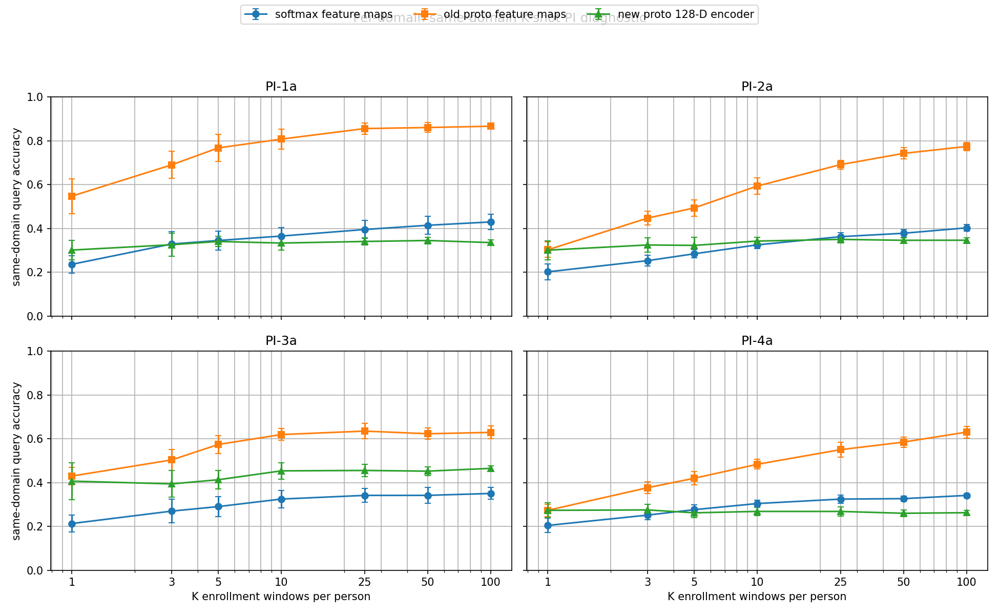

### Interpretation

This diagnostic resolves the apparent contradiction from the mixed-source experiment. The old raw-feature prototypical model performs strongly when enrollment and query come from the same PI domain: it reaches about `87%` on `PI-1a`, `77%` on `PI-2a`, `63%` on `PI-3a`, and `63%` on `PI-4a` at `K=100`.

However, the same model performed poorly in the mixed-source diagnostic, where each prototype averaged samples from `PI-1a`, `PI-2a`, and `PI-3a` together. This strongly suggests that the learned embedding contains person information, but person clusters are fragmented by Wi-Fi domain. In other words, the model can identify people after same-domain enrollment, but a single prototype does not represent one person cleanly across different PI configurations.

The new 128-D projection-head model is not competitive here. It stays mostly flat and low, except for moderate performance on `PI-3a`. This supports the earlier suspicion that the large projection head compressed or distorted useful feature-map geometry instead of improving it.

For the project narrative, the old prototypical feature-map model is currently the strongest few-shot baseline. The important finding is not simply "prototype training works"; it is more specific:

```text
same-domain few-shot enrollment works well,
but mixed-domain prototypes expose domain-fragmented identity embeddings.
```

The next method should therefore target domain-stable identity embeddings, most likely through supervised contrastive learning and/or a smaller pooled projection head rather than the current large flatten MLP.

## 2026-05-29 - Pooled-Head Prototypical Model Comparison

### Question

Does replacing the large flatten-MLP projection head with a compact pooled projection head improve the prototypical embedding?

### Setup

- Data: `data/doppler_traces_pi`
- Persons: all 10 PI identities, `p03`, `p05`-`p13`
- Evaluation protocols:
  - mixed-source K-shot: `PI-1a`, `PI-2a`, `PI-3a` pooled
  - per-domain same-domain K-shot: `PI-1a`, `PI-2a`, `PI-3a`, `PI-4a`
- Enrollment split: `0.0`-`0.6`
- Query split: `0.6`-`0.8`
- Trials per K: `20`
- Compared embeddings:
  - softmax-trained SHARP feature maps
  - old prototypical model using raw SHARP feature maps
  - prototypical model with large flatten-MLP 128-D head
  - prototypical model with compact pooled 128-D head

The pooled head is architecturally cleaner than the large flatten-MLP head:

```text
SHARP feature map [3, 170, 50]
-> AdaptiveAvgPool2d((10, 10))
-> Flatten(300)
-> Linear(300 -> 128)
-> normalize
```

This reduces the projection head from about `6.56M` parameters to `38,528` parameters.

### Mixed-Source Result

Mixed-source K-shot means one prototype per person is built from pooled `PI-1a`, `PI-2a`, and `PI-3a` enrollment samples, then evaluated on pooled held-out source query windows.

| K | Softmax feature maps | Old proto feature maps | Flatten-MLP proto 128-D | Pooled-head proto 128-D |
| ---: | ---: | ---: | ---: | ---: |
| 1 | `0.1727` | `0.2361` | `0.2181` | `0.2108` |
| 3 | `0.2346` | `0.2547` | `0.2691` | `0.2563` |
| 5 | `0.2390` | `0.2715` | `0.2712` | `0.2675` |
| 10 | `0.2499` | `0.2702` | `0.2889` | `0.2727` |
| 25 | `0.2800` | `0.2672` | `0.2905` | `0.2852` |
| 50 | `0.2988` | `0.2684` | `0.2980` | `0.2836` |
| 100 | `0.2949` | `0.2629` | `0.3014` | `0.2804` |

### Same-Domain K=100 Result

| Domain | Softmax feature maps | Old proto feature maps | Flatten-MLP proto 128-D | Pooled-head proto 128-D |
| --- | ---: | ---: | ---: | ---: |
| `PI-1a` | `0.4298` | `0.8670` | `0.3356` | `0.4805` |
| `PI-2a` | `0.4028` | `0.7746` | `0.3463` | `0.2322` |
| `PI-3a` | `0.3505` | `0.6294` | `0.4652` | `0.3565` |
| `PI-4a` | `0.3416` | `0.6307` | `0.2626` | `0.2324` |

### Artifacts

- Pooled-head training run: [experiments/few_shot_proto_evaluation/proto_pooled_head_vs_softmax_baseline_20260528_220334](../experiments/few_shot_proto_evaluation/proto_pooled_head_vs_softmax_baseline_20260528_220334)
- Model comparison run: [experiments/few_shot_model_comparison/proto_model_comparison_with_pooled_head_20260529_20260529_091003](../experiments/few_shot_model_comparison/proto_model_comparison_with_pooled_head_20260529_20260529_091003)

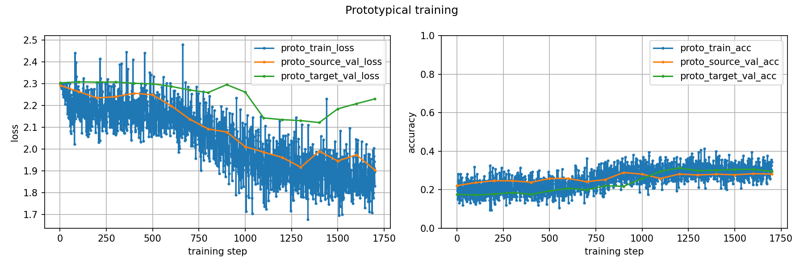

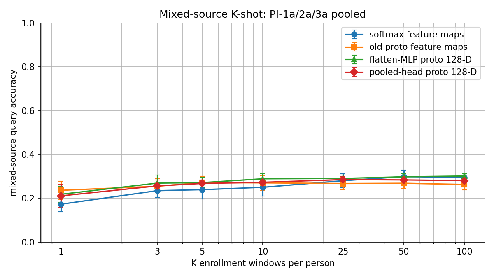

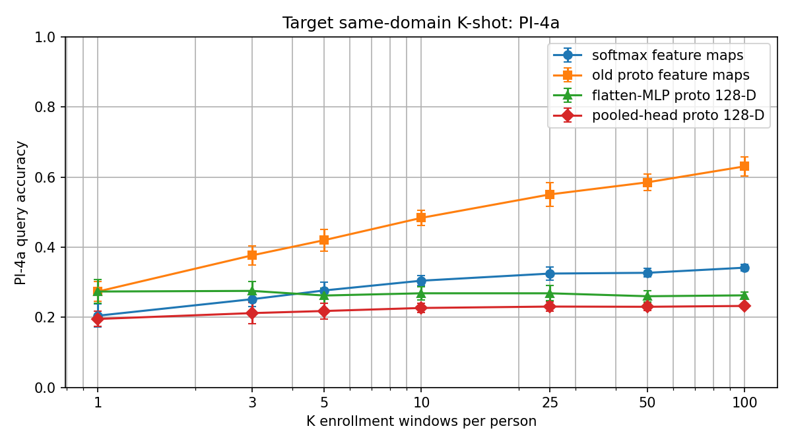

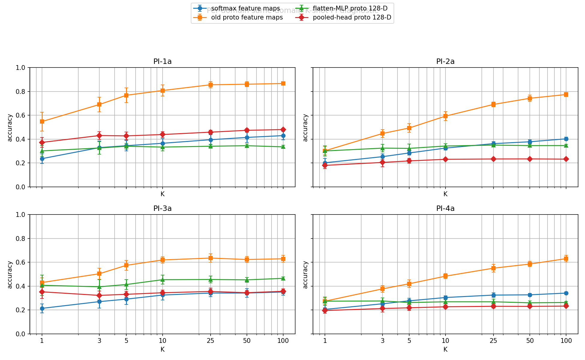

### Interpretation

The pooled head is more reasonable architecturally, and its training curves are somewhat cleaner than the large flatten-MLP head. However, the final few-shot results are still weak. In mixed-source K-shot, all methods remain clustered around `0.26`-`0.30`, so the pooled head does not solve the cross-domain prototype problem.

For same-domain K-shot, the old raw-feature prototypical model remains clearly strongest. At `K=100`, it reaches `0.8670` on `PI-1a`, `0.7746` on `PI-2a`, `0.6294` on `PI-3a`, and `0.6307` on `PI-4a`. The pooled head only improves over the flatten-MLP head on `PI-1a`; it is worse on `PI-2a`, `PI-3a`, and `PI-4a`.

This suggests that the useful identity information is present in the high-dimensional SHARP feature maps, but the learned compact projection heads are not preserving that geometry under prototypical training. The current evidence supports keeping the raw-feature prototypical model as the strongest few-shot baseline and moving away from prototypical-from-scratch head tuning.

The stable project finding is now:

```text
Doppler feature maps support same-domain few-shot person enrollment,
but compact learned prototype embeddings have not solved the domain-fragmentation problem.
```

The next method should be supervised contrastive learning or a raw CSI comparison, not further minor tuning of the prototypical head.

## 2026-05-29 - UMAP Embedding Diagnostic

### Question

What structure do the learned embeddings contain: person identity, Wi-Fi domain/setup, or neither?

### Setup

- Data: `data/doppler_traces_pi`
- Domains: `PI-1a`, `PI-2a`, `PI-3a`, `PI-4a`
- Persons: all 10 PI identities
- Sample: `75` windows per person per domain, `3000` windows total
- Compared embeddings:
  - old raw SHARP feature-map prototypical model
  - pooled-head 128-D prototypical model
- Dimensionality reduction:
  - raw feature maps: `25500-D -> PCA 50-D -> UMAP 2-D`
  - pooled head: `128-D -> PCA 50-D -> UMAP 2-D`
- Plots:
  - same UMAP coordinates colored by person
  - same UMAP coordinates colored by domain

### Artifacts

- Run directory: [experiments/embedding_umap/raw_featuremap_vs_pooled_head_umap_20260529_102603](../experiments/embedding_umap/raw_featuremap_vs_pooled_head_umap_20260529_102603)
- Script: [scripts/plot_embedding_umap.py](../scripts/plot_embedding_umap.py)

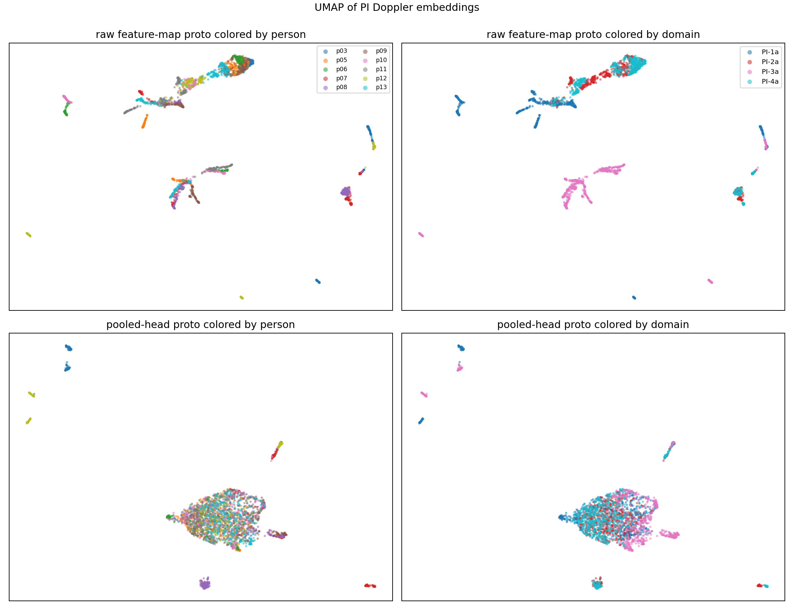

### Interpretation

The raw feature-map UMAP shows clear structure. When colored by domain, the largest visible regions are strongly associated with PI domain/setup. When colored by person, there are smaller local clusters and subclusters, but they are embedded inside larger domain-specific structures.

This matches the K-shot results:

```text
same-domain K-shot works:
  because within one domain, person subclusters are locally separable

mixed-source K-shot fails:
  because one person's samples are split across domain-specific regions
```

In other words, the raw SHARP feature maps appear to preserve person-specific information, but that information is entangled with Wi-Fi setup/domain effects. The representation is not naturally organized as one global cluster per person.

The pooled-head UMAP is different. It mostly forms a large mixed cloud with weak visible person structure. It also does not show clean domain separation. This means the pooled head should not be interpreted as a good domain-invariant embedding. It is more likely a weak compressed representation that lost much of the useful high-dimensional structure from the raw feature maps.

This explains why the pooled-head K-shot curve is poor in almost every setting. More enrollment samples do not help much because the embedding does not create stable person neighborhoods.

### Why Domain Appears Without Domain Labels

The model does not need explicit domain labels to encode domain information. Domain affects the Doppler input distribution directly through:

- Tx/Rx geometry
- monitor position
- LOS/NLOS condition
- receiver hardware
- antenna response
- residual multipath and noise profile
- typical movement trajectories inside the room

If `PI-1a` spectrograms look systematically different from `PI-4a` spectrograms, the SHARP feature extractor can preserve that difference even when the training objective is person identification.

The person-ID objective says:

```text
separate people
```

It does not explicitly say:

```text
make the same person overlap across PI domains
```

Therefore the model can learn a representation shaped like:

```text
PI-1a region:
  p03, p05, p06, ...

PI-2a region:
  p03, p05, p06, ...

PI-3a region:
  p03, p05, p06, ...
```

This can still support same-domain enrollment because the local person neighborhoods inside each domain are useful. However, it fails when a single prototype averages samples from multiple domains.

### Consequence

The UMAP result supports the current project interpretation:

```text
Doppler contains person-specific information,
but the strongest visible structure in raw SHARP features is domain/setup.
Person identity appears as local structure inside domain regions.
Compact learned prototype heads have not produced a robust domain-invariant identity embedding.
```

This motivates either:

- supervised contrastive learning with domain-balanced positive pairs, e.g. same person across different domains as positives
- or a raw CSI comparison to test whether raw CSI preserves identity differently from Doppler

It does not motivate further small tweaks to the current prototypical heads.

## 2026-05-29 - New Direction: Raw CSI Few-Shot Baseline

### Motivation

The Doppler experiments show that SHARP Doppler feature maps contain person-specific information, but that information is strongly entangled with PI domain/setup. The compact prototypical heads did not recover a robust identity embedding.

This motivates a direct representation comparison:

```text
Doppler spectrogram embeddings
vs
raw CSI amplitude embeddings
```

The research question becomes:

```text
Does raw CSI preserve identity information that SHARP Doppler discards,
and how does this trade off against domain sensitivity?
```

This direction is inspired by SimID, which performs few-shot person recognition from CSI using prototypical learning. However, SimID uses the XRF55 dataset, where Wi-Fi samples are already stored as real-valued tensors shaped like `270 x 1000`. Our data is the SHARP 80 MHz PI dataset, where each `.mat` contains a Nexmon `csi_buff` matrix with interleaved monitor antennas and 256 OFDM bins. Therefore we cannot copy SimID preprocessing literally; we first need SHARP-compatible raw-file parsing to recover antenna/subcarrier time series.

### Raw CSI Preprocessing

Implemented script:

- [src/scripts/preprocess_raw_csi_pi.py](../src/scripts/preprocess_raw_csi_pi.py)

The preprocessing deliberately combines only the parts needed from each source:

```text
SHARP/Nexmon parsing
↓
raw amplitude CSI tensor
↓
SimID-style Butterworth filtering
↓
saved trace-level .npz files
```

From SHARP we copy the file-format and Nexmon cleanup steps:

- load `csi_buff` from the raw `.mat`
- apply `np.fft.fftshift` over OFDM bins
- remove all-zero packet rows
- split interleaved rows into the 4 monitor antenna streams
- remove the same non-data/control subcarrier indices used by SHARP:

```python
[0, 1, 2, 3, 4, 5, 127, 128, 129, 251, 252, 253, 254, 255]
```

This converts the 256 stored OFDM bins into the 242 data subcarriers described in the SHARP and dataset papers.

From SHARP we also keep per-packet mean-amplitude normalization:

```text
amplitude(packet, subcarrier) / mean_amplitude(packet)
```

This matches the original SHARP raw parsing scale normalization. It may remove some global received-power identity information, so it should be logged as a design choice and possibly ablated later.

From SimID we copy the denoising idea:

```text
second-order Butterworth low-pass filter
normalized cutoff = 0.02
applied independently over time to each CSI row
```

In SimID, a row is one real-valued CSI stream. In our adapted representation, the equivalent row is one `(antenna, subcarrier)` amplitude trace over packet time.

The output trace format is:

```text
data/raw_csi_traces_pi/
  PI-1a/
    PI1a_p03.npz
    ...
```

Each saved file contains:

```text
csi      : float32 [4, 242, T]
label    : "p03", ...
scenario : "PI-1a", ...
source_file
```

The script writes `metadata.json` documenting the SHARP-copied parsing steps, SimID filtering parameters, subcarrier deletion, and output layout.

Important: this is not SHARP Doppler preprocessing. We intentionally do not apply:

- SHARP phase sanitization
- H reconstruction
- Doppler FFT/profile extraction

The result remains raw-amplitude CSI.

### Storage Decision

We save preprocessed traces rather than filtering on the fly. A single raw trace can be large:

```text
4 antennas x 242 subcarriers x ~45,000 packets
≈ 43.5M float values
≈ 174 MB as float32
```

Across the PI subset, uncompressed raw CSI traces can take several GB. The script supports `--compressed` to trade lower disk usage for slower loading. We still save traces, not windows, because trace-level storage lets us later change:

- window length
- window stride
- train/query split
- few-shot enrollment sampling
- normalization ablations

without rerunning raw preprocessing.

### Raw CSI Encoder Architecture

Implemented model:

- [src/wifi_doppler/models/raw_csi.py](../src/wifi_doppler/models/raw_csi.py)

The model is SimID-inspired but smaller and adapted to our SHARP PI raw CSI format.

Expected input:

```text
[batch, channels, time]
```

For the first dataset class, we will flatten the saved trace layout:

```text
[4, 242, T] -> [968, T]
```

So the model sees:

```text
channels = 4 monitor antennas x 242 data subcarriers = 968
```

Architecture:

```text
Input: [B, 968, T]

Channel mixer:
  Conv1d(968, 128, kernel_size=1, bias=False)
  BatchNorm1d(128)
  ReLU

Temporal stem:
  Conv1d(128, 128, kernel_size=7, stride=2, padding=3, bias=False)
  BatchNorm1d(128)
  ReLU

Temporal residual body:
  ResidualBlock1d(128 -> 128, stride=1)
  ResidualBlock1d(128 -> 128, stride=1)
  ResidualBlock1d(128 -> 256, stride=2)

Projection:
  AdaptiveAvgPool1d(1)
  Linear(256 -> 128)
  L2 normalize
```

Parameter count for the expected SHARP PI input:

```text
in_channels = 968
trainable parameters = 798,848
```

This is much smaller than SimID's SE-ResNet10 encoder, which is about `3.16M` parameters, but much larger and more appropriate for raw CSI than the tiny SHARP Doppler pooled encoder.

### Architecture Inspiration and Changes

What we copy from SimID conceptually:

- use raw CSI time series rather than Doppler
- process CSI as a temporal signal with `Conv1d`
- produce embeddings for prototype/few-shot evaluation
- use Butterworth-filtered CSI as input

What we do differently:

- SimID input is `270 x 1000`, where `270 = 9 links x 30 subcarriers`
- our input is `968 x T`, where `968 = 4 monitor antennas x 242 subcarriers`
- SimID uses SE-ResNet10; we start with a smaller residual Conv1d encoder
- SimID has many more subjects/actions, so copying the full encoder may overfit our smaller PI subset

The `1x1` channel mixer is the key adaptation. A direct first temporal convolution would be:

```text
Conv1d(968, 128, kernel_size=7)
```

which immediately mixes almost one thousand antenna/subcarrier streams across time. Instead we split the problem:

```text
1. Conv1d(968, 128, kernel_size=1)
   learn useful antenna/subcarrier mixtures at each time instant

2. Conv1d(128, 128, kernel_size=7)
   learn temporal patterns from compressed CSI streams
```

This keeps all subcarriers available to the model, but reduces the parameter count and gives the encoder a cleaner inductive bias:

```text
first learn which channel combinations matter,
then learn how those combinations evolve over time.
```

We do not share a separate encoder across subcarriers. Subcarrier index has physical meaning, and averaging independently encoded subcarriers would likely discard cross-subcarrier structure. This matches SimID's choice to stack link/subcarrier streams as channels and process them jointly.

### Next Experiment

The next implementation step is a raw CSI window dataset that loads saved `.npz` traces and emits:

```text
x: [968, 340]
y: person label
```

Then evaluate the raw CSI encoder using the same few-shot protocols already used for Doppler:

```text
same-domain K-shot
PI-1a/2a/3a source enrollment -> PI-4a target query
PI-4a target-domain enrollment/query
```

This will let us test whether raw CSI improves identity preservation relative to SHARP Doppler, and whether any improvement is limited to same-domain conditions or survives PI domain shift.
